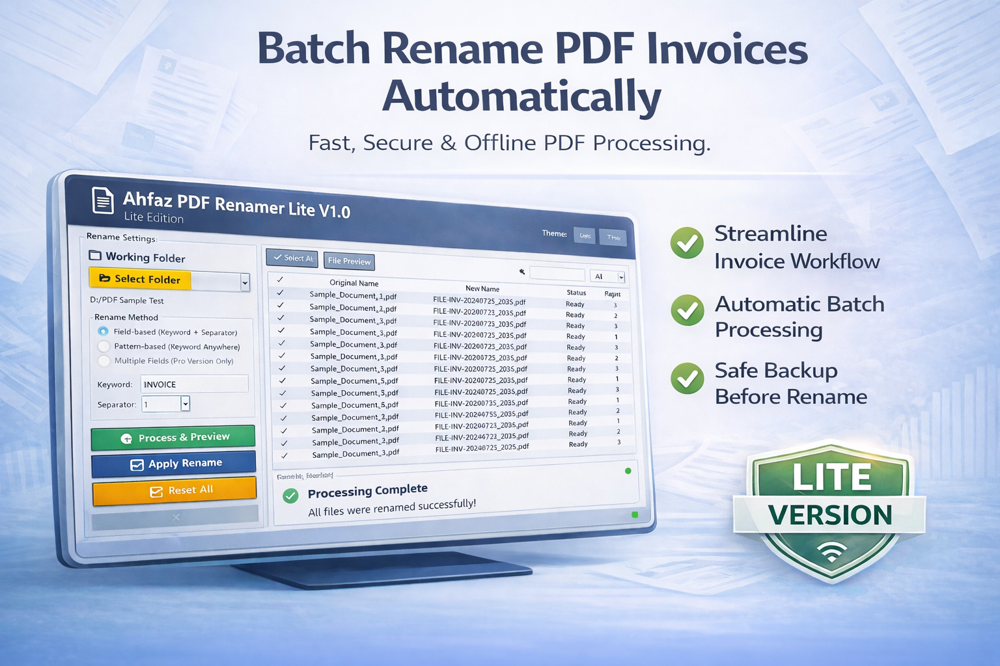
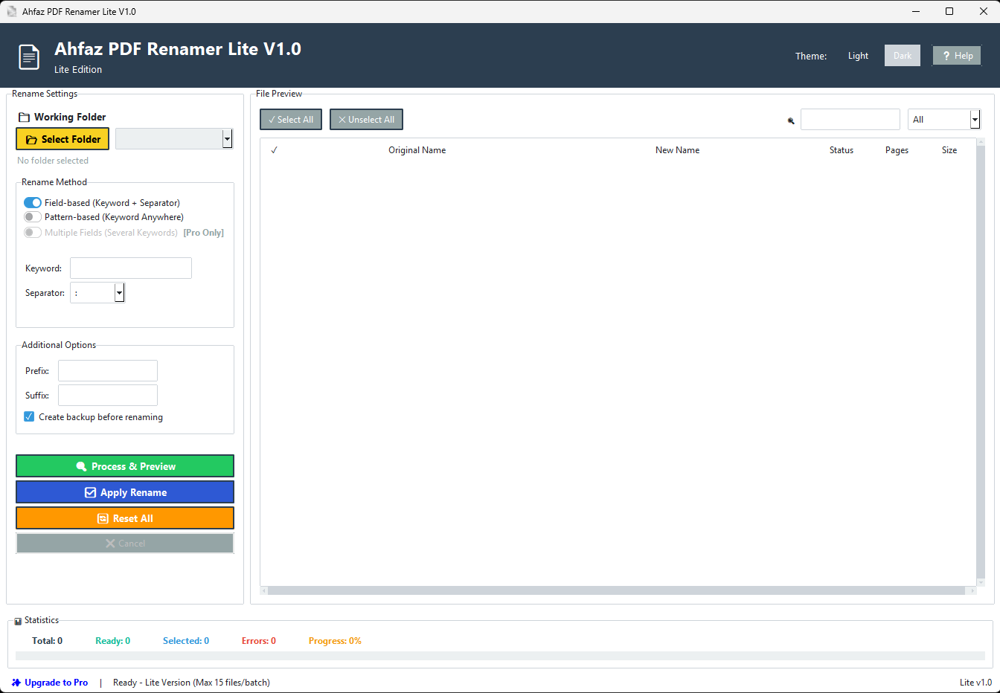
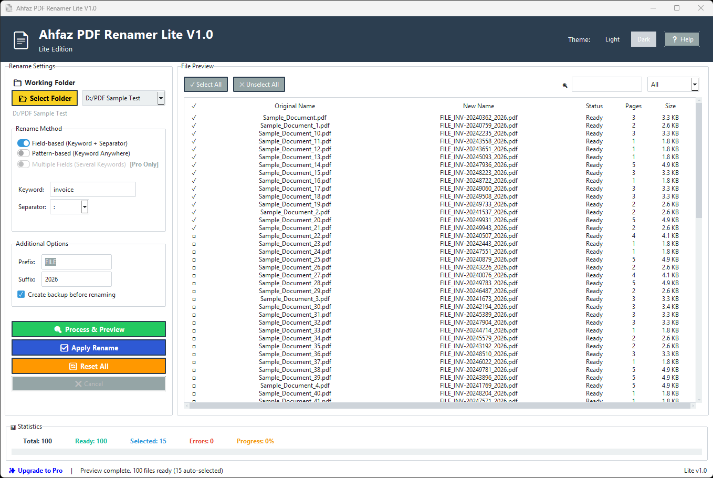

# Bulk PDF Invoice Rename Tool for Windows

  

Ahfaz PDF Rename Lite is a simple and efficient **bulk PDF rename tool** designed for Windows users who need to rename multiple invoice PDF files quickly and accurately.

If you work in accounting, finance, administration, or export-import documentation, this tool helps you save hours of manual renaming.

---

## 🔹 What This Tool Does

- Rename multiple PDF invoice files at once
- Apply custom keywords automatically
- Clean and simple Windows interface
- Fast batch processing
- Designed specifically for invoice workflows

This is not a cloud tool.  
No upload required. Everything runs locally on your computer.

---

## 🖥 Application Interface

  

The interface is designed for simplicity:
- Add multiple invoice PDFs
- Choose rename method
- Apply keyword
- Process instantly

---

## ⚡ Example: Invoice Rename Processing

  

Bulk renaming completed in seconds with clean output file names.

Perfect for:
- Accounting departments
- Finance administrators
- Small business owners
- Import-export documentation teams

---

## 🎯 Why Use a Bulk PDF Rename Tool?

Manually renaming invoice PDF files is:
- Slow
- Error-prone
- Repetitive

Using a dedicated **invoice PDF rename software** ensures:
- Consistency
- Speed
- Accuracy
- Better file organization

---

## 💻 System Requirements

- Windows 10 / 11
- No installation complexity
- Lightweight desktop application

---

## 📥 Download Lite Version

👉 Get the Lite version here:  
[YOUR_GUMROAD_LINK]

---

## 🔎 Keywords

bulk rename pdf  
rename invoice pdf  
invoice pdf rename tool  
batch pdf rename windows  
accounting pdf rename software  

---

### Developed for professionals who handle invoice PDFs daily.
